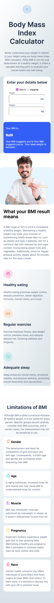

# Frontend Mentor - Body Mass Index Calculator solution

This is a solution to the [Body Mass Index Calculator challenge on Frontend Mentor](https://www.frontendmentor.io/challenges/body-mass-index-calculator-brrBkfSz1T). Frontend Mentor challenges help you improve your coding skills by building realistic projects.

## Table of contents

- [Overview](#overview)
  - [The challenge](#the-challenge)
  - [Screenshot](#screenshot)
  - [Links](#links)
- [My process](#my-process)
  - [Built with](#built-with)
  - [What I learned](#what-i-learned)
  - [Continued development](#continued-development)
  - [Useful resources](#useful-resources)
- [Author](#author)
- [Acknowledgments](#acknowledgments)

## Overview

### The challenge

Users should be able to:

- Select whether they want to use metric or imperial units
- Enter their height and weight
- See their BMI result, with their weight classification and healthy weight range
- View the optimal layout for the interface depending on their device's screen size
- See hover and focus states for all interactive elements on the page

### Screenshot

### Links

- Solution URL: [https://github.com/cwwittor/bmi-calculator](https://github.com/cwwittor/bmi-calculator)
- Live Site URL: [https://bmi-calculator-d7k.pages.dev/](https://bmi-calculator-d7k.pages.dev/)

## My process

### Built with

- Semantic HTML5 markup
- CSS custom properties
- Flexbox
- CSS Grid
- Mobile-first workflow

### What I learned

I wasn't really happy with my results in this project. It both felt like it took me twice as long as previous ones, as well as it feels like I just did a very poor job at planning/setup to where I had to rewrite a good bit.

I have learned that in a lot of cases it is probably better to reuse similar paragraph styling in multiple parts unless it is at a very small scale, ran into problems when I had used the same subtext class in multiple places but had to change it differently once I upped viewports.

I have learned the initial setup and planning of divs is very important, had to reformat a bit once I hit desktop size.

I have learned more about color gradients in css.

### Continued development

I think the thing I want to work on more with my next project is the initial setup and planning of how things are going to be connected. Just planning in general is a need since I feel like more structure and less tedious structure would help my next project.

### Useful resources

- For this project I mainly used w3 schools and raycast

## Author

- Frontend Mentor - [@cwwittor](https://www.frontendmentor.io/profile/cwwittor)
